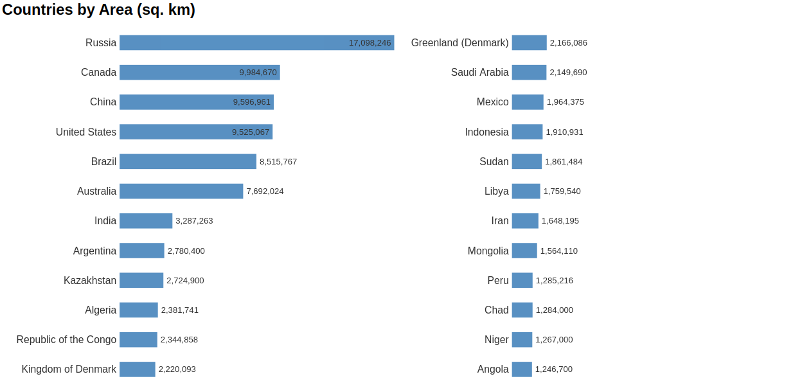

# Split_Bar_Chart
Interactive bar chart that splits in two columns if width of svg is greater than height

## Table of Contents
<ol>
   <li><a href="#head1"> Description of the project</a>
   <li><a href="#head2"> Libraries used </a>
   <li><a href="#head3"> Directory structure </a>
   <li><a href="#head4"> Usage </a>
   <li><a href="#head5"> Author </a>
</ol>


<h2 id="head1"> Description of the project </h2>
Given JSON array of object with the Name, Value properties, it creates an interactive bar chart. If width is greater than height the chart splits into two columns to utilize more horizontal space.

<h2 id="head2"> Libraries used </h2>

<ul>
 <li> d3.js
</ul>

<h2 id="head3"> Directory structure </h2>

```
.
├── data                                                    # Folder to hold data files
    ├── data.csv                                            # Data in CSV format
    ├── data.js                                             # Data in JSON format
├── js                                                      # Folder to hold JS files
    ├── d3-v4.js                                            # d3 v4 file
    ├── SplitBar.js                                         # Main JS code for split bar chart creation
├── screen_shots                                            # Folder to hold screen shots
    ├── bar_chart.png                                       # Screen shot of created bar chart
├── index.html                                              # Index HTML file
├── README.md                                               # ReadMe file

```

<h2 id="head4"> Usage </h2>

In the HTML page:
1. Include d3.js file
2. Include SplitBar.js file
3. Invoke the SplitBar method, passing in the d3 selection of div element to hold the chart, data array, title, topN, and format. The objects in data array must have the 'Name', and 'Value' attributes.

Below is sample invocation and corresponding chart.


```
SplitBar({'divElement': d3.select('#chart'), 
						'dataArr':data, 
						'title':"Countries by Area (sq. km)",
						'topN':24,
						'format':"int"
						});
```



<h2 id="head5"> Author </h2>

[Shahzeb Akhtar](https://www.linkedin.com/in/shahzebakhtar/)
